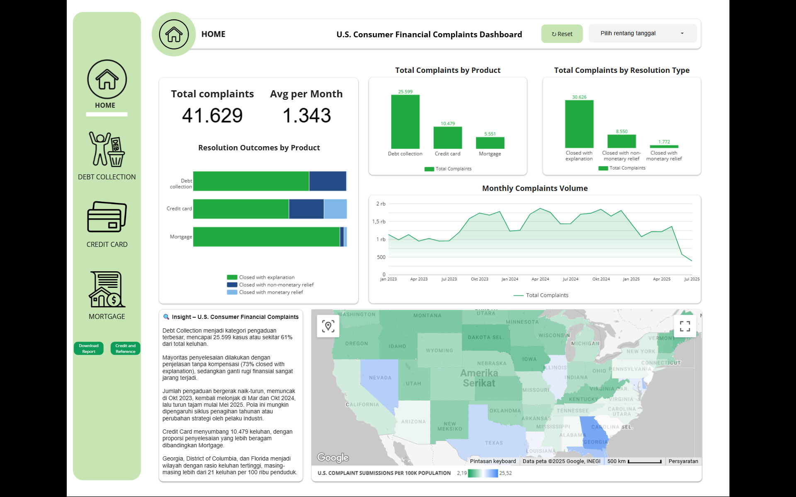

# Data Science Academy - Debt Collection Analysis

**Dashboard Looker Studio:** [Lihat di sini](https://lookerstudio.google.com/s/gHHsQsfOGmg)

## Deskripsi
Proyek ini menganalisis data keluhan konsumen terkait produk keuangan di Amerika Serikat menggunakan dataset dari CFPB. Visualisasi dan analisis dilakukan dengan memperhatikan standar desain dan aksesibilitas.

## Referensi Dataset
- [Dataset CFPB Compfest](https://www.kaggle.com/datasets/deltakrist/final-project-data-science-academy-compfest-17)

## Referensi Visualisasi Data
- [Panduan Visualisasi Data CFPB](https://cfpb.github.io/design-system/guidelines/data-visualization-guidelines#guidelines)

## Referensi Warna & Aksesibilitas
- [Panduan Warna CFPB](https://cfpb.github.io/design-system/foundation/color#accessibility)

## Referensi Populasi
- [Population people in US (2020 Census)](https://data.census.gov/table/DECENNIALCD1182020.P1?t=Populations+and+People&g=010XX00US$0400000&y=2020)

## Kredit Ikon
- [Credit card icons](https://www.flaticon.com/free-icons/credit-card) by Freepik - Flaticon
- [Homepage icons](https://www.flaticon.com/free-icons/homepage) by pojok d - Flaticon
- [Loan icons](https://www.flaticon.com/free-icons/loan) by iconixar - Flaticon
- [Repayment icons](https://www.flaticon.com/free-icons/repayment) by syafii5758 - Flaticon
# Data Science Academy - Debt Collection Analysis

img('./data/Dasboard.png')
link dashboard: [Link Dashboard Looker Studio](https://lookerstudio.google.com/s/gHHsQsfOGmg)
## Deskripsi
Proyek ini menganalisis data keluhan konsumen terkait produk keuangan di Amerika Serikat, menggunakan dataset dari CFPB. Visualisasi dan analisis dilakukan sesuai dengan standar desain dan aksesibilitas.

---

## Referensi Dataset
- [Dataset CFPB Compfest](https://www.kaggle.com/datasets/deltakrist/final-project-data-science-academy-compfest-17)

## Referensi Visualisasi Data
- [Panduan Visualisasi Data CFPB](https://cfpb.github.io/design-system/guidelines/data-visualization-guidelines#guidelines)

## Referensi Warna & Aksesibilitas
- [Panduan Warna CFPB](https://cfpb.github.io/design-system/foundation/color#accessibility)

## Referensi Populasi
- [Population people in US (2020 Census)](https://data.census.gov/table/DECENNIALCD1182020.P1?t=Populations+and+People&g=010XX00US$0400000&y=2020)

---

## Kredit Ikon
- [Credit card icons](https://www.flaticon.com/free-icons/credit-card) by Freepik - Flaticon
- [Homepage icons](https://www.flaticon.com/free-icons/homepage) by pojok d - Flaticon
- [Loan icons](https://www.flaticon.com/free-icons/loan) by iconixar - Flaticon

- [Repayment icons](https://www.flaticon.com/free-icons/repayment) by syafii5758 - Flaticon
